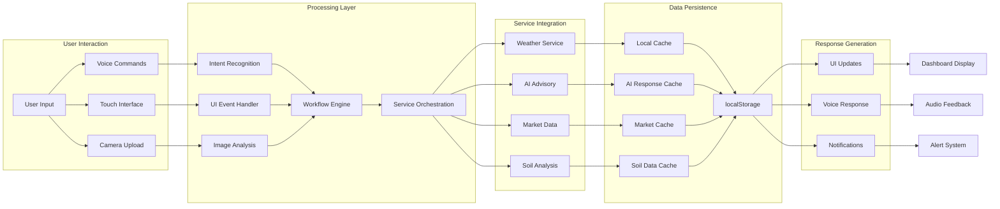
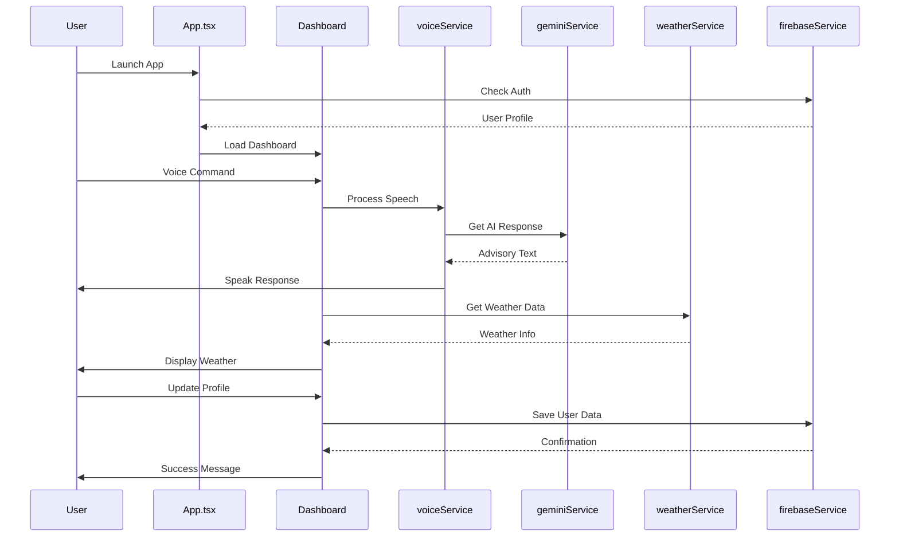

# SmartAgri+ Architecture Diagram

```mermaid
graph TB
    %% User Interface Layer
    subgraph "Frontend (React + Vite)"
        A[App.tsx] --> B[Dashboard]
        B --> C[WeatherCard]
        B --> D[MarketView]
        B --> E[DailyPlanner]
        B --> F[VoiceAssistant]
        B --> G[DiseaseDetector]
        B --> H[SoilHealth]
        B --> I[YieldCalculator]
        B --> J[SchemesAdvisor]
        B --> K[IncomeDashboard]
        B --> L[CarbonDashboard]
        B --> N[SustainabilityScore]
    end

    subgraph "Services Layer"
        P[weatherService] --> Q[OpenWeatherMap API]
        R[geminiService] --> S[Google Gemini AI]
        X[firebaseService] --> Y[Firebase Auth]
        Z[voiceService] --> AA[Web Speech API]
        BB[marketService] --> CC[Market Price APIs]
        DD[soilService] --> EE[SoilGrids API]
        FF[cropService] --> GG[Crop Knowledge Base]
        HH[advisoryService] --> II[Rule Engine]
        JJ[workflowEngine] --> KK[AI Workflows]
    end

    %% Data Layer
    subgraph "Data Storage"
        LL[localStorage - Tasks]
        MM[localStorage - Preferences]
        NN[Firebase Firestore - User Data]
        OO[External APIs - Real-time Data]
    end

    subgraph "External Services"
        PP[Google Gemini AI]
        QQ[OpenWeatherMap]
        TT[SoilGrids]
        UU[Market APIs]
        VV[Firebase]
    end

    A --> P
    A --> R
    A --> X
    A --> Z
    A --> DD
    A --> FF
    A --> HH
    A --> JJ

    P --> LL
    R --> S
    X --> AA
    Z --> BB
    DD --> EE
    FF --> GG
    HH --> II
    JJ --> KK

    S --> PP
    Q --> QQ
    EE --> TT
    BB --> UU
    Y --> VV

    LL --> NN
    MM --> NN
    OO --> NN
```

# Data Flow Architecture

```mermaid
flowchart LR
    subgraph "User Interaction"
        A[User Input] --> B[Voice Commands]
        A --> C[Touch Interface]
        A --> D[Camera Upload]
    end

    subgraph "Processing Layer"
        B --> E[Intent Recognition]
        C --> F[UI Event Handler]
        D --> G[Image Analysis]
        
        E --> H[Workflow Engine]
        F --> H
        G --> H
        
        H --> I[Service Orchestration]
    end

    subgraph "Service Integration"
        I --> J[Weather Service]
        I --> K[AI Advisory]
        I --> L[Market Data]
        I --> M[Soil Analysis]
    end

    subgraph "Data Persistence"
        J --> O[Local Cache]
        K --> P[AI Response Cache]
        L --> Q[Market Cache]
        M --> R[Soil Data Cache]
        
        O --> T[localStorage]
        P --> T
        Q --> T
        R --> T
    end

    subgraph "Response Generation"
        T --> U[UI Updates]
        T --> V[Voice Response]
        T --> W[Notifications]
    end

    U --> X[Dashboard Display]
    V --> Y[Audio Feedback]
    W --> Z[Alert System]
```

# Component Interaction Flow

```mermaid
sequenceDiagram
    participant U as User
    participant A as App.tsx
    participant D as Dashboard
    participant VS as voiceService
    participant GS as geminiService
    participant WS as weatherService
    participant FS as firebaseService
    
    U->>A: Launch App
    A->>FS: Check Auth
    FS-->>A: User Profile
    A->>D: Load Dashboard
    
    U->>D: Voice Command
    D->>VS: Process Speech
    VS->>GS: Get AI Response
    GS-->>VS: Advisory Text
    VS->>U: Speak Response
    
    D->>WS: Get Weather Data
    WS-->>D: Weather Info
    D->>U: Display Weather
    
    U->>D: Update Profile
    D->>FS: Save User Data
    FS-->>D: Confirmation
    D->>U: Success Message
```
